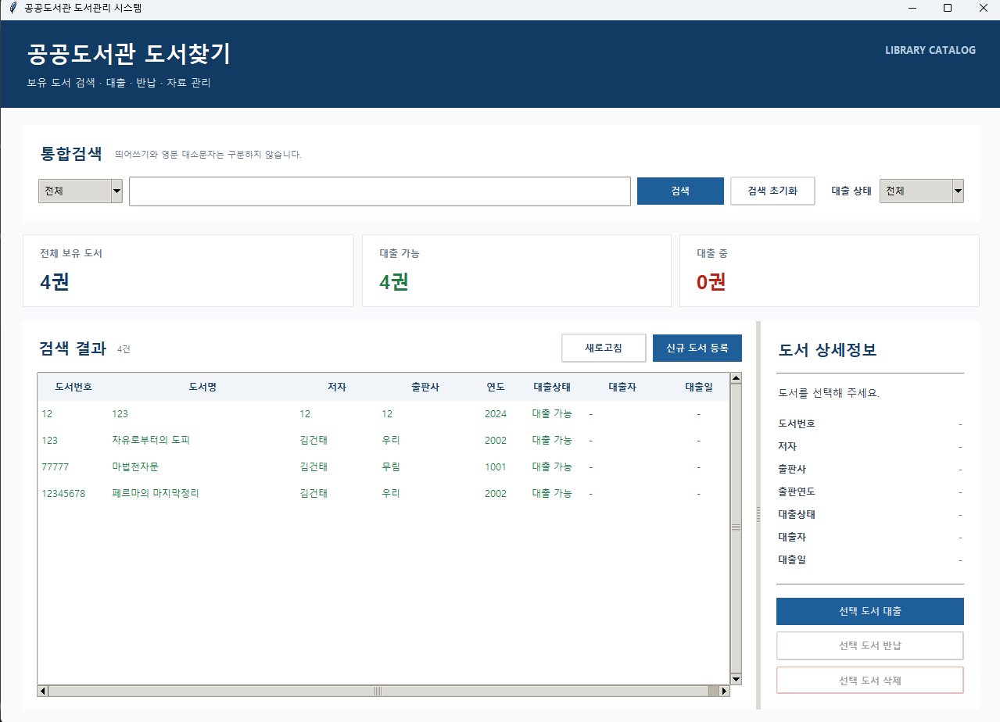
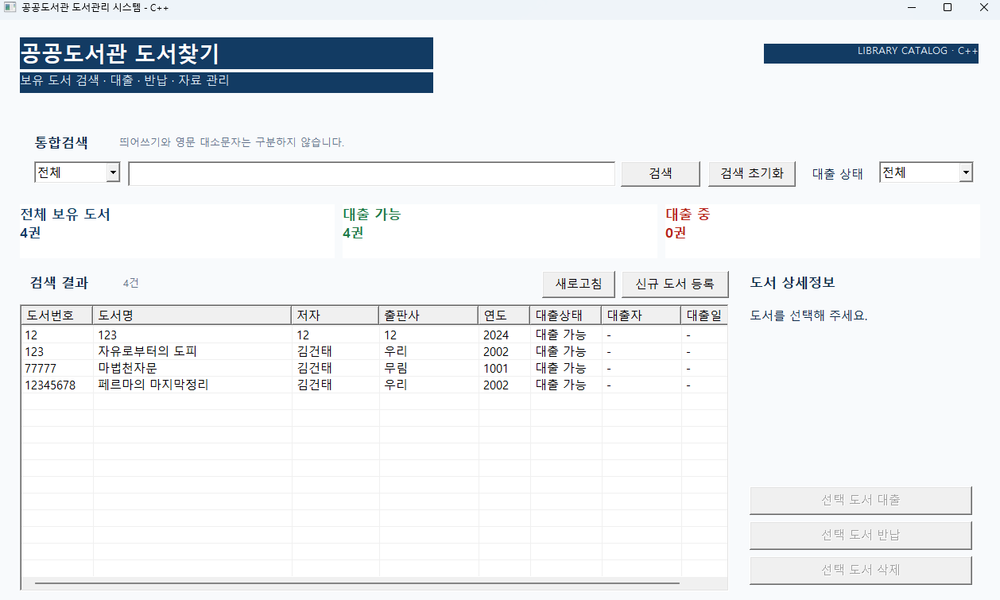
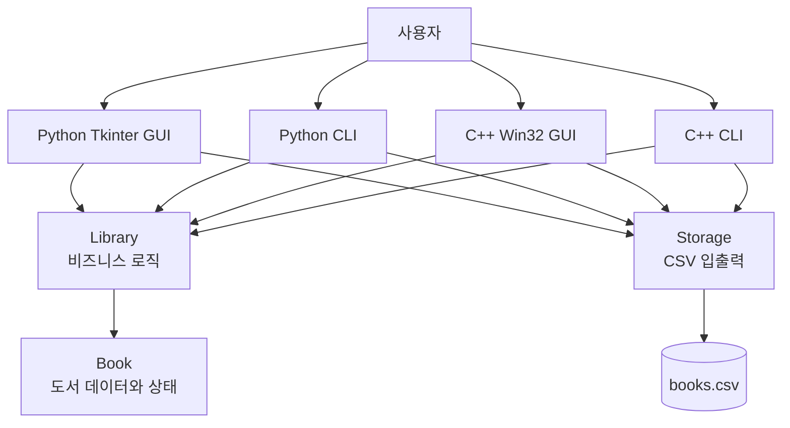

# 도서관리 시스템

> Python과 C++로 동일한 기능을 구현하고, 하나의 UTF-8 CSV 파일을 공유하는 도서 검색·대출·반납 관리 프로그램

<p align="center">
  <strong>Python Tkinter GUI · C++ Win32 GUI · Console CLI · CSV Persistence</strong>
</p>

---

## 프로젝트 소개

이 프로젝트는 도서관 관리자가 보유 도서를 등록하고 검색하며, 대출·반납·삭제 상태를 관리할 수 있도록 만든 데스크톱 도서관리 시스템입니다.

같은 요구사항을 **Python**과 **C++17**로 각각 구현했으며, 두 버전은 동일한 데이터 구조와 CSV 규격을 사용합니다.

```text
Python GUI / Python CLI
             ↓
        Library 로직
             ↓
        UTF-8 books.csv
             ↑
        Library 로직
             ↑
C++ GUI / C++ CLI
```

Python에서 등록하거나 대출한 도서를 C++ 프로그램에서 확인할 수 있고, C++에서 반납한 결과도 Python 프로그램에서 그대로 불러올 수 있습니다.

---

## 실행 화면

<table>
  <tr>
    <th>Python · Tkinter</th>
    <th>C++ · Win32 API</th>
  </tr>
  <tr>
    <td></td>
    <td></td>
  </tr>
</table>

두 GUI는 같은 도서 데이터와 핵심 동작 규칙을 사용하지만, UI 구현 기술은 서로 다릅니다.

- Python: 표준 라이브러리 `tkinter`와 `ttk`
- C++: 외부 GUI 프레임워크 없이 Windows Win32 API

---

## 주요 기능

### 도서 관리

- 신규 도서 등록
- 전체 보유 도서 조회
- 도서번호 중복 등록 방지
- 대출 가능한 도서 삭제
- 대출 중인 도서 삭제 차단
- 삭제 전 최종 확인

### 검색

- 통합검색
- 도서번호 검색
- 제목 부분 검색
- 저자 부분 검색
- 영문 대소문자 무시
- 제목과 저자 검색 시 띄어쓰기 차이 무시
- 대출 가능 / 대출 중 상태 필터
- GUI 표의 열 제목을 이용한 정렬

예를 들어 등록된 제목이 `파이썬 기초 입문`이라면 다음 검색어로도 찾을 수 있습니다.

```text
파이썬기초
파이 썬 기초
파이썬    기초
```

### 대출과 반납

- 대출자 이름 입력
- 대출 시 현재 날짜 자동 기록
- 이미 대출 중인 도서의 중복 대출 차단
- 반납 시 대출자와 대출일 자동 초기화
- 작업 성공 후 CSV 자동 저장

### 파일 저장

- UTF-8 CSV 자동 저장·불러오기
- 프로그램 재실행 후 데이터 복원
- 쉼표와 큰따옴표가 포함된 필드 처리
- 일부 손상된 CSV 행은 건너뛰고 정상 행 복원
- 임시 파일을 먼저 기록한 뒤 실제 파일로 교체하는 안전 저장

---

## 기술 스택

| 구분 | Python | C++ |
|---|---|---|
| 언어 | Python 3.12+ | C++17 |
| GUI | Tkinter / ttk | Win32 API |
| CLI | `main.py` | `library_cli` |
| 빌드 | Python 직접 실행 | CMake + MSVC |
| 테스트 | pytest | CTest + 자체 테스트 실행 파일 |
| 저장 | UTF-8 CSV | UTF-8 CSV |
| 데이터 파일 | `library_management_python/books.csv` | Python과 같은 파일 공유 |

---

## 프로젝트 구조

```text
library/
├─ README.md
├─ pic/
│  ├─ python도서찾기프로그램.png
│  └─ cpp도서찾기프로그램.png
│
├─ library_management_python/
│  ├─ gui_app.py              # Tkinter GUI
│  ├─ main.py                 # Python 콘솔 프로그램
│  ├─ models.py               # Book 데이터 모델
│  ├─ library.py              # 등록·검색·대출·반납·삭제 로직
│  ├─ storage.py              # CSV 저장 및 불러오기
│  ├─ utils.py                # 입력 검증·날짜·문자열 처리
│  ├─ run_gui.bat             # Python GUI 실행 파일
│  └─ tests/                  # pytest 테스트
│
├─ LibraryManagement_CPP/
│  ├─ include/                # 헤더 파일
│  ├─ src/                    # 핵심 로직 구현
│  ├─ app/
│  │  ├─ console_main.cpp     # C++ 콘솔 프로그램
│  │  └─ gui_main.cpp         # C++ Win32 GUI
│  ├─ tests/                  # C++ 자동 테스트
│  ├─ CMakeLists.txt
│  ├─ build_and_test.bat
│  ├─ run_gui.bat
│  ├─ run_cli.bat
│  └─ README.md
│
└─ docs/                      # PRD와 단계별 구현 기준서
```

---

## 설계 구조



핵심 로직을 UI와 분리했기 때문에 콘솔 프로그램과 GUI가 같은 기능을 재사용합니다.

### 구성 요소별 책임

| 구성 요소 | 책임 |
|---|---|
| `Book` | 도서 한 권의 정보, 대출 상태, 대출·반납 상태 전환 |
| `Library` | 도서 목록, 등록, 검색, 대출, 반납, 삭제, 중복 검사 |
| `Storage` | CSV 저장, 불러오기, 형식 변환, 파일 오류 처리 |
| `Utils` | 입력 검증, 날짜 생성, 문자열 정규화 |
| GUI / CLI | 사용자 입력과 화면 표시, 핵심 로직 호출 |

---

# 사용 방법

## 1. 저장소 내려받기

PowerShell에서 다음 명령을 실행합니다.

```powershell
git clone https://github.com/rjsxo943-gif/library.git
cd library
```

이미 저장소를 내려받았다면 최신 버전을 받습니다.

```powershell
git pull origin main
```

---

# Python 버전

## 실행 환경

- Python 3.12 이상 권장
- Windows에서는 Tkinter가 일반적인 Python 설치에 기본 포함
- GUI 실행에는 외부 패키지가 필요하지 않음
- 테스트를 실행하려면 `pytest` 필요

Python 버전을 확인합니다.

```powershell
python --version
```

## Python GUI 실행

```powershell
cd library_management_python
python gui_app.py
```

또는 탐색기에서 다음 파일을 더블클릭합니다.

```text
library_management_python/run_gui.bat
```

## Python CLI 실행

```powershell
cd library_management_python
python main.py
```

CLI 메뉴:

```text
1. 도서 등록
2. 전체 도서 조회
3. 도서 검색
4. 도서 대출
5. 도서 반납
6. 도서 삭제
7. 파일 저장
0. 프로그램 종료
```

## Python 테스트

`pytest`가 없다면 한 번만 설치합니다.

```powershell
python -m pip install pytest
```

테스트 실행:

```powershell
cd library_management_python
python -m pytest -v
```

---

# C++ 버전

## 실행 환경

Windows에서 Visual Studio Installer를 열고 다음 구성요소를 설치합니다.

- **C++를 사용한 데스크톱 개발**
- **Windows SDK**
- **CMake tools for Windows**

CMake가 설치되었는지 확인합니다.

```powershell
cmake --version
```

## C++ 빌드 및 테스트

저장소 루트에서 다음 명령을 실행합니다.

```powershell
cd LibraryManagement_CPP
.\build_and_test.bat
```

이 스크립트는 다음 작업을 수행합니다.

```text
CMake 프로젝트 생성
→ Release 빌드
→ C++ 테스트 실행
→ GUI와 CLI 실행 파일 생성
```

직접 명령으로 실행할 수도 있습니다.

```powershell
cd LibraryManagement_CPP
cmake -S . -B build -A x64
cmake --build build --config Release
ctest --test-dir build -C Release --output-on-failure
```

빌드 설정이 꼬였을 때는 `build` 폴더를 삭제한 뒤 다시 빌드합니다.

```powershell
Remove-Item -Recurse -Force .\build
.\build_and_test.bat
```

## C++ GUI 실행

빌드를 마친 뒤 다음 파일을 실행합니다.

```powershell
.\run_gui.bat
```

직접 실행:

```powershell
.\build\Release\library_gui.exe ..\library_management_python\books.csv
```

## C++ CLI 실행

```powershell
.\run_cli.bat
```

직접 실행:

```powershell
.\build\Release\library_cli.exe ..\library_management_python\books.csv
```

---

# GUI 조작 방법

## 도서 검색

1. 검색 기준을 `전체`, `제목`, `저자`, `도서번호` 중에서 선택합니다.
2. 검색어를 입력합니다.
3. `검색` 버튼을 누르거나 `Enter`를 입력합니다.
4. 필요하면 대출 상태 필터에서 `대출 가능` 또는 `대출 중`을 선택합니다.
5. `검색 초기화`를 누르면 전체 목록으로 돌아갑니다.

## 신규 도서 등록

1. `신규 도서 등록` 버튼을 누릅니다.
2. 도서번호, 도서명, 저자, 출판사, 출판연도를 입력합니다.
3. 등록을 완료하면 목록과 CSV 파일에 즉시 반영됩니다.

도서번호는 전체 목록에서 고유해야 합니다.

## 도서 대출

1. 목록에서 `대출 가능` 상태의 도서를 선택합니다.
2. 오른쪽 상세정보 영역의 `선택 도서 대출` 버튼을 누릅니다.
3. 대출자 이름을 입력합니다.
4. 대출일은 현재 날짜로 자동 기록됩니다.

## 도서 반납

1. 목록에서 `대출 중` 상태의 도서를 선택합니다.
2. 오른쪽 상세정보 영역의 `선택 도서 반납` 버튼을 누릅니다.
3. 확인창에서 반납을 승인합니다.
4. 대출 상태가 `대출 가능`으로 바뀌고 대출자·대출일이 초기화됩니다.

## 도서 삭제

1. 목록에서 삭제할 도서를 선택합니다.
2. `선택 도서 삭제` 버튼을 누릅니다.
3. 확인창에서 삭제를 승인합니다.

대출 중인 도서는 바로 삭제할 수 없습니다. 먼저 반납해야 합니다.

## 단축키

| 키 | 동작 |
|---|---|
| `Enter` | 검색 실행 |
| `Ctrl + N` | 신규 도서 등록 |
| `F5` | 목록 새로고침 |

---

## 빠른 체험 시나리오

처음 프로젝트를 확인할 때 다음 순서로 실행하면 핵심 기능을 빠르게 체험할 수 있습니다.

```text
1. GUI 실행
2. 신규 도서 한 권 등록
3. 제목의 띄어쓰기를 다르게 입력하여 검색
4. 검색 결과에서 도서 선택
5. 대출 처리
6. 대출 상태 필터에서 '대출 중' 확인
7. 반납 처리
8. 프로그램 종료
9. 다른 언어 버전을 실행하여 같은 데이터 확인
```

예시:

```text
Python에서 B0001 도서 등록
→ C++ GUI 실행
→ B0001 검색
→ C++에서 대출
→ Python GUI 재실행
→ 대출 중 상태 확인
```

---

## Python과 C++ 데이터 공유

두 버전은 기본적으로 다음 파일을 함께 사용합니다.

```text
library_management_python/books.csv
```

CSV 헤더:

```csv
book_id,title,author,publisher,year,is_borrowed,borrower,borrowed_date
```

| 필드 | 설명 |
|---|---|
| `book_id` | 도서 고유 번호 |
| `title` | 도서 제목 |
| `author` | 저자 |
| `publisher` | 출판사 |
| `year` | 출판 연도 |
| `is_borrowed` | `true` 또는 `false` |
| `borrower` | 대출자 이름 |
| `borrowed_date` | `YYYY-MM-DD` 형식의 대출일 |

> 두 프로그램이 같은 CSV 파일을 사용하므로 Python과 C++ 프로그램을 동시에 열어 서로 다른 내용을 수정하는 것은 권장하지 않습니다. 한 프로그램을 종료해 저장을 마친 뒤 다른 프로그램을 실행하는 방식이 안전합니다.

---

## 입력 및 상태 검증

- 빈 도서번호, 제목, 저자, 출판사 입력 차단
- 출판 연도는 1000년부터 현재 연도까지만 허용
- 도서번호 앞뒤 공백 제거
- 영문 도서번호 대소문자 차이 무시
- 중복 도서번호 등록 차단
- 이미 대출 중인 도서의 재대출 차단
- 대출되지 않은 도서의 반납 차단
- 대출 중인 도서의 삭제 차단
- 대출 상태와 대출자·대출일의 데이터 무결성 유지

---

## 테스트 범위

### Python

- `Book` 기본 상태와 데이터 무결성
- 등록과 중복 ID 차단
- 제목·저자 부분 검색
- 띄어쓰기와 영문 대소문자를 무시하는 검색
- 정상 대출·중복 대출 차단
- 정상 반납·잘못된 반납 차단
- 정상 삭제·대출 중 삭제 차단
- 한글과 쉼표가 포함된 CSV 저장·복원
- 파일 없음, 빈 파일, 손상된 행 처리
- 입력값 검증
- CLI 통합 흐름
- GUI 검색과 필터 보조 로직

### C++

- `Book` 생성과 상태 전환
- Library 등록·검색·대출·반납·삭제
- 띄어쓰기 무시 검색
- 통합검색과 대출 상태 필터
- Python과 동일한 CSV 규격
- 한글과 쉼표 포함 필드의 CSV 왕복
- 손상된 CSV 행 처리
- CMake 빌드 및 CTest 실행

---

## Python과 C++ 구현 비교

| 항목 | Python | C++ |
|---|---|---|
| 도서 목록 | `list[Book]` | `std::vector<Book>` |
| 데이터 모델 | `dataclass` | 캡슐화된 클래스 |
| 검색 결과 | `list[Book]` | 포인터 목록 |
| GUI | Tkinter / ttk | Win32 API |
| 예외 처리 | Python 예외 | 표준 C++ 예외 |
| 빌드 | 인터프리터 직접 실행 | CMake + MSVC 빌드 |
| CSV | Python `csv` 모듈 | CSV 인용 규칙 직접 처리 |
| 공통점 | 동일한 기능 규칙과 CSV 형식 | 동일한 기능 규칙과 CSV 형식 |

---

## 핵심 설계 포인트

### UI와 비즈니스 로직 분리

콘솔과 GUI는 사용자 입력과 화면 표시만 담당합니다. 도서 등록·검색·대출·반납·삭제 규칙은 `Library`에 모아 두었습니다.

### 구조화된 작업 결과

대출·반납·삭제 작업은 성공 여부뿐 아니라 결과 코드, 메시지, 대상 도서를 함께 전달합니다. 따라서 콘솔에서는 텍스트를 출력하고 GUI에서는 메시지 상자를 표시할 수 있습니다.

### 검색어 정규화

제목과 저자 검색에서는 모든 공백과 영문 대소문자를 정규화한 뒤 부분 문자열을 비교합니다. 글자가 다른 일반 오타까지 허용하지는 않으며, 띄어쓰기 차이를 안전하게 흡수합니다.

### 안전한 파일 저장

데이터를 기존 CSV 파일에 바로 덮어쓰지 않고 임시 파일에 먼저 기록합니다. 전체 기록이 성공한 경우에만 실제 데이터 파일로 교체하여 저장 중 오류로 인한 손상 위험을 줄였습니다.

### 언어 간 데이터 계약

Python과 C++에서 다음 항목을 동일하게 유지합니다.

- Book 필드 8개
- CSV 헤더와 필드 순서
- UTF-8 인코딩
- `true` / `false` 대출 상태
- `YYYY-MM-DD` 날짜 형식
- 검색·대출·반납·삭제 규칙

---

## 향후 확장 계획

- 도서 정보 수정
- 자동 도서번호 생성
- 대출 이력 분리 저장
- 회원 관리
- 반납 예정일과 연체 관리
- CSV에서 SQLite로 전환
- ISBN 및 도서 표지 외부 검색
- 관리자 로그인과 권한 관리
- 웹 또는 REST API 버전

---

## 프로젝트 목표

이 프로젝트는 단순한 메뉴 프로그램을 만드는 데 그치지 않고 다음 내용을 학습하고 검증하는 것을 목표로 합니다.

- 객체지향 설계와 클래스 책임 분리
- Python과 C++의 구현 방식 비교
- 상태를 가진 데이터의 무결성 관리
- CSV 영속성과 언어 간 데이터 호환
- GUI와 비즈니스 로직의 분리
- 단위 테스트와 통합 테스트
- Windows 데스크톱 애플리케이션 빌드
